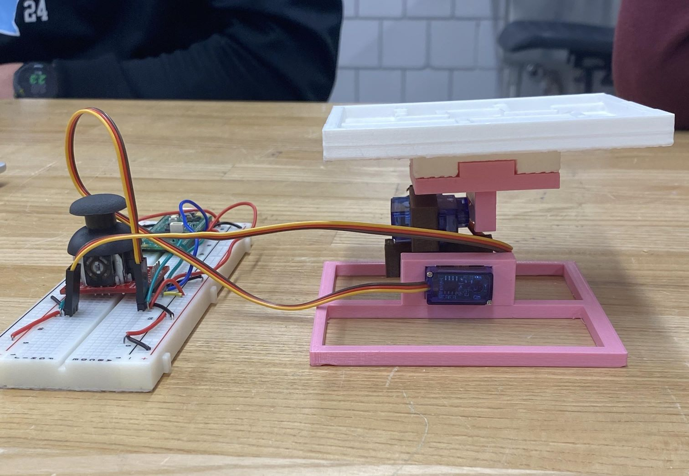

# 3D Maze Servo Control

This project contains code to control a 3D-printed tilt maze using two servo motors and an Arduino-compatible microcontroller. The servos adjust the angle of the maze along the X and Y axes, allowing a ball to navigate the maze path.

!

## Description

The Arduino code reads predefined movement sequences or sensor input (if integrated) and translates them into servo positions. This tilts the platform holding the maze, guiding a ball from the start to the end.

## Hardware Requirements

- 1 × Raspberry Pi Pico or Arduino Uno (or compatible alternative)
- 2 × SG90 or MG90S servo motors
- Jumper wires
- Analog Joystick
- 3D-printed maze mounted on a tilting platform

## 📜 License

MIT License — use, modify, and share freely.

---
Code by Abas Ismael and Artisom Baranovich
